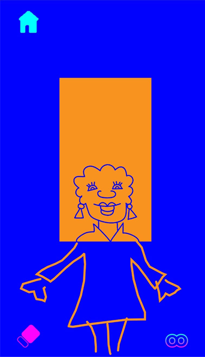
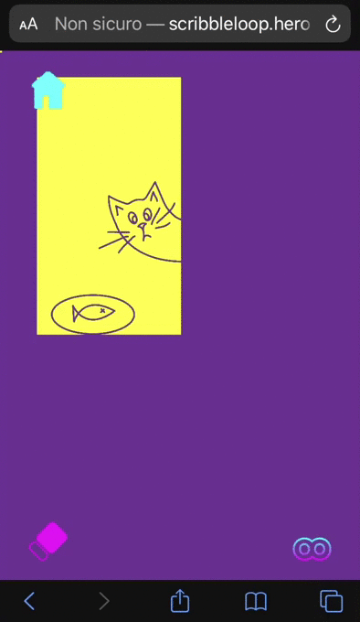
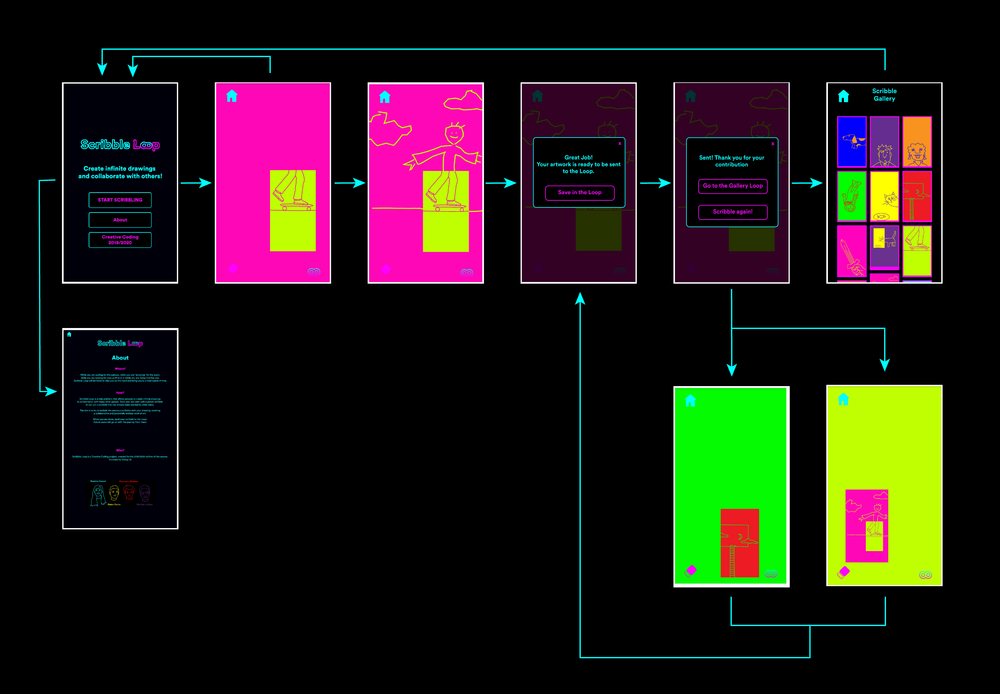

### Team members:

-   [Beatrice Foresti](mailto:bea_fiore@live.it)
-   [Pietro Forino](mailto:pietrof@live.com)
-   [Emanuele Ghebaur](mailto:emanueleghebaur@gmail.com)
-   [Michele La Rosa](mailto:miki.larosa@hotmail.it)

### Course:

[Creative Coding 2019/2020](https://drawwithcode.github.io/2019/) 
**Politecnico di Milano** - Scuola del Design 
**Faculty:** Michele Mauri, Andrea Benedetti

## Images

<<<<<<< HEAD
Here's a gif that shows how our project works:

And here's how the same interface looks like from a mobile phone:

=======

>>>>>>> 0e3e59146dfbc62bf9b9d06c3f5b3b496bff42bc

## Project idea

**What if you could draw an infinite sketch? And what if you could share it with people and collaborate with them to continue their drawings?**

**Scribble Loop** is the answer!

Our inspiration comes from the artist [Pablo Rochat](http://pablorochat.com). He overcomes the limit of the artist canvas by creating an Instagram Stories “game”: he tags an artist in his story and invites him to go on with his first drawing and re-post it.

We started our project inspired by Pablo’s idea and we made it bigger.
Scribble Loop is a web platform that allows everyone to create infinite drawings and collaborate with others. Each user can start with a preset drawing or can join a drawing that has already been scribbled by other users. The drawing will be saved and reloaded to allow other users to go on with it. Only two colors are available in every sketch, and you can’t decide the location of the previous resized sketch. These limitations are meant to enhance your creativity!

## Design challenges

The design corporate image is simple and intuitive. We chose bright colors (pink and light blue) on a black background in order to accentuate the bright colors the user will use in its scribbles. The Loop logo represents both the potentially infinite drawings our project is able to create, and the merging (with its gradient) of different people's artworks.

The design interactions are meant to be as intuitive and minimal as possible. The platform is structured into 4 main pages:

<ul>
  <li> Home page </li>
  <li> About </li>
  <li> Scribble </li>
  <li> Gallery Loop </li>
</ul>

In the Home page there are 3 buttons with different functions: start the scribble, go to the About page and go to the Course's page.

The most important page is the Scribble page where the user can draw and express his creativity by interacting with mouse or touch.

<ul>
  <li>
    <b> Mouse interaction </b> 
    In the desktop interface the main interaction is with the mouse which becomes the brush. As you enter the scribble sketch, you can simply draw lines by moving the mouse.
  </li>
  <li>
    <b> Touch interaction </b> 
    On the mobile devices the users can draw by touching the screen.  
  </li>
  <li>  
    <b> iframe </b> 
     We chose to use an iframe in the desktop and not to create a new interface in order to maintain the proportions of the sketches and an overall consistency of content. For this reason we created an iframe with a 16:9 ratio, which is the ratio of most mobile phones.
   </li>
  </ul>

One of the most innovative elements is the connection between users. In fact each user can interact with a scribble that is the result of the interaction of another user before him. This way the platform is a loop of sketches and it connects people simply by sharing and by drawing scribbles. Other innovative challenges are the limits of this connection: you can’t modify the previous sketch nor his position on yours, but you can only add “creativity” to it, you can't change your brush' color or thickness. Limitations make creativity grow!

## Code challenges

<ol>
  <li>
    <b>Saving the sketches</b> 
  The first challenge we had to face was how to save the sketches. We needed to get a screenshot which could be saved remotely on a server and not locally ( save() was not helpful).

  The first approach was to save the code itself using a server-as-service: Firebase. This choice became inconvenient when we had a second level scribble loop (a “scribble around a scribble, around a scribble”): the transformations management wasn’t intuitive or trackable enough, since the overlapping of multiple transformations needed the same number of counter-transformations to compensate.

  At this point we decided to save the sketch by creating an image file. At first, we tried to utilize the **saveFrames()** function, which on paper seemed a great option because it could use a callback to remotely save the sketch. This strategy quickly revealed itself to be ineffective, since it was a function optimised for saving animations, and a single frame file created an unpredictable and variable file.

  The best solution we came up with was a combination of the **html2canvas.js** library and the **imgBase64** encoding, which allowed to create a good quality and very light file:

      $(function() {
      $("#saveLoop").click(function() {
        html2canvas($("#screen"), {
          onrendered: function(canvas) {
            var imgsrc = canvas.toDataURL("image/png");

            $("#newimg").attr('src', imgsrc);
            $("#img").show();
            $("#newimg").show();
            $("#createImg").hide();

            var dataURL = canvas.toDataURL();

            $.ajax({
              type: "POST",
              url: "script.php",
              data: {
                imgBase64: dataURL
              }
            }).done(function(o) {
              console.log('saved');
            });
           }
         });
       });

 </li>
   <li>
     <b>Storing the pre-saved sketches</b> 
  When the png files were created, we needed to remotely save them. Our first option was **Firebase** as an image storage service, but its limitations (slow upload, limited space) brought us to try a storage directly on the used server.

  The best solution was the **php** language, thanks to his optimal directory management and its ability to write remotely files on a server. With **ajax** we sent the php file in post mode, so that we could write and manage a file on a remote server. We also chose to use the **jquery** library for a better php language management.

        $.ajax({
            type: "POST",
            url: "script.php",
            data: {
               imgBase64: dataURL
            }
        })

      	server.php

      	 $img = $_ POST['imgBase64'];
       	 $img = str_replace('data:image/png;base64,', '', $img);
       	 $img = str_replace(' ', '+', $img);
       $data = base64_decode($img);
       $file = 'newSketches/' . uniqid() . '.png';
       $success = file_put_contents($file, $data);
       print $success ? $file : 'Impossibile salvare il file sul server';

 </li>
 <li>
  <b>Picking randomly the skecthes</b> 
  The imgBase64 image encoding had a problem: the random name creation, with no logic whatsoever. This made it impossible to call back the images with a function in order to make them appear in the sketch or in the gallery.

  Php came to our rescue once again: javascript doesn’t allow us to access entire folders, but php does. This way, with a few lines of code, we could assign a variable that would be used in the p5js file and show every image in the “newSketches” folder in a css-managed disposition.

    

     $imagesDir = 'newSketches/';
     $images = glob($imagesDir . ' * .{jpg,jpeg,png,gif}', GLOB_BRACE);
     $randomImage = $images[array_rand($images)];

 </li>
 <li>
  <b>Dynamic server instead of static server</b> 
  One of the biggest obstacles to us was the creation of a dynamic php server manageable by Heroku. We needed a dynamic server able to continuously create new files and compatible with php language. Github, in this sense, had some technical limitations being a static server.

  At first we wanted to upload on a dynamic server just the needed parts, keeping most of the files and the source code on Github. At the end, though, we decided to convert the entire project in php language, to enhance not only the cohesion, but mainly the manageability. This conversion was as simple as necessary, since php perfectly recognizes html language but not the other way around.

  Therefore, with **Composer**, **PHP**, **Heroku** and its optimal communication with repository management directly from Github, we created a totally independent and working php app.

    composer.json

    {
      "require": {
        "php": "^7.2.0"
      }
    }

 </li>
 <li>
  <b>Keeping track of the color's switching</b> 
  Keeping track of the color was one of the hardest challenge of the project. We considered to create a json for the storage of the colors, but it was an unsuitable solution for a project that aims to create infinite sketches. We also considered to create a sort of metadatas, thanks to the imgBase64 structure which allows, but it was exif matadata, so hardly storable in long sequences.

  We found a solution which allows us to not store the information in an external file, having at the same time a nice level of precision. We drawn two small square of 2 pixels per side in the top-left corner of the 10 initial sketches, and thanks to the get function we could “read” the color and assign their values to the variables coloreUno and coloreDue. With this method we had solved the problem of keeping the colors, without increasing the sizes of the files and the information to read.

      image(img1, 0, 0, 1080 / 5, 1920 / 5)

      coloreUno = get(fx * 4 + 2, fy * 4 + 1); // pick up the background color
      coloreDue = get(fx * 4, fy * 4); // pick up the stroke color

      background(coloreDue);
      print("coloreUno: " + coloreUno, "coloreDue: " + coloreDue);

      push()
      scale(k); // scale of the sketch
      translate(-fx * 4, -fy * 4); // translate of the whole sketch
      noStroke()
      fill(coloreUno)
      rect(0, 0, 2, 2)
      fill(coloreDue)
      rect(3, 0, 2, 2)
      pop()

 </li>
</ol>

## Inspirations / References

[Pablo Rochat](http://pablorochat.com)

## Credits ( third libraries used )

**P5.js, jQuery, PHP, html2canvas.js, Composer**
